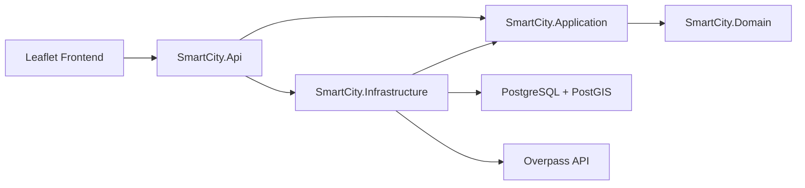

# SmartCity Location Intelligence

ASP.NET Core, PostgreSQL/PostGIS, OpenStreetMap/Overpass ve Leaflet ile geliştirilmiş CBS tabanlı acil hizmet konum analizi ve karar destek sistemi.

## Proje Hakkında

SmartCity Location Intelligence, yapılandırılabilir bir pilot bölge için hastane, itfaiye istasyonu ve ana yol verilerini OpenStreetMap'den alır; mekânsal verileri PostGIS üzerinde saklar ve aynı origin üzerinden sunulan Türkçe/İngilizce Leaflet arayüzünde görselleştirir.

Projenin temel amacı:

> Harita üzerinde seçilen bir konumun acil hizmetlere erişimini mekânsal olarak analiz eden ve olay yönetimi için açıklanabilir karar desteği sağlayan CBS tabanlı bir sistem.

Mevcut pilot alan, İstanbul Beşiktaş çevresindeki sınırlı bir bounding box'tır. Alanın bilinçli olarak küçük tutulması, herkese açık Overpass API kaynaklarının sorumlu kullanılmasını ve demonun hızlı tekrarlanabilmesini sağlar.

## Problem ve Amaç

Acil hizmetlerin operasyonel değeri yalnızca mevcut olmalarına değil, olay konumuna göre mekânsal yakınlıklarına da bağlıdır. Geleneksel bir CRUD uygulaması bu ilişkiyi tek başına açıklayamaz.

Bu proje aşağıdaki teknik yaklaşımı gösterir:

- Açık coğrafi veriyi güvenli ve idempotent biçimde içeri aktarmak.
- Nokta ve çizgi geometrilerini mekânsal bir veritabanında saklamak.
- Mesafe ve en yakın komşu işlemlerini C# belleğine taşımadan PostGIS üzerinde çalıştırmak.
- Analiz sonuçlarını anlaşılır, test edilebilir ve açıklanabilir karar kurallarına dönüştürmek.

## Temel Özellikler

- Hastane, itfaiye istasyonu ve ana yollar için idempotent OpenStreetMap import işlemi.
- Yapılandırılabilir primary/fallback Overpass endpointleri ve sınırlı timeout değerleri.
- Metre cinsinden en yakın hastane ve itfaiye istasyonu analizi.
- Kural tabanlı coverage, accessibility ve incident priority hesaplamaları.
- Önerilen hizmet, öncelik skoru ve seviyesiyle birlikte olay kaydı.
- Veritabanı tarafında dashboard aggregation ve en güncel olay sorguları.
- Bağımsız katmanlara, analiz panellerine ve olay markerlarına sahip Leaflet haritası.
- Türkçe ve İngilizce kullanıcı arayüzü.
- Liveness/readiness health endpointleri ve tutarlı API hata yanıtları.
- Mevcut doğrulama sonucuna göre başarıyla geçen 177 otomatik test.

## Sistem Mimarisi

Çözüm, pragmatik bir Clean Architecture bağımlılık yönü kullanır:

**Domain ← Application ← Infrastructure / API**



- `SmartCity.Domain`: Entity, enum ve mekânsal domain durumlarını içerir.
- `SmartCity.Application`: Use case'leri, abstraction/interface'leri, DTO'ları, validation ve deterministik analiz kurallarını barındırır.
- `SmartCity.Infrastructure`: PostgreSQL/PostGIS erişimini ve Overpass entegrasyonunu gerçekleştirir.
- `SmartCity.Api`: Dependency composition, controller'lar, health check'ler ve statik frontend hosting görevlerini üstlenir.
- `frontend`: Vanilla JavaScript ve Leaflet kullanan same-origin istemcidir.
- `tests`: İş kurallarını ve entegrasyon sınırlarını otomatik olarak doğrular.

Ayrıntılı diyagramlar ve istek akışları için [mimari dokümanı](docs/architecture.md) ile [request flow dokümanına](docs/request-flows.md) bakılabilir.

## Kullanılan Teknolojiler

| Alan | Teknoloji |
| --- | --- |
| API ve runtime | .NET 10, ASP.NET Core |
| Veri erişimi | EF Core 10, Npgsql |
| Mekânsal model | PostGIS, NetTopologySuite, SRID 4326 |
| Veritabanı | PostgreSQL 17, PostGIS 3.5 |
| Kaynak veri | OpenStreetMap, Overpass QL |
| Frontend | HTML, CSS, Vanilla JavaScript, Leaflet 1.9.4 |
| Test | xUnit, EF Core InMemory, coverlet |
| Yerel orkestrasyon | Docker Compose |

## CBS / GIS Yaklaşımı

- Hastaneler ve itfaiye istasyonları `Point` geometrisi olarak saklanır.
- Yollar `LineString` geometrisi olarak saklanır.
- OpenStreetMap longitude/latitude değerleri SRID 4326 ile X/Y düzeninde temsil edilir.
- GiST spatial index'ler mekânsal sorgular için uygun erişim yolları sağlar.
- En yakın hizmet sorgusu, PostGIS `ST_Distance` fonksiyonunu `geography` üzerinde çalıştırır; sonuç koordinat derecesi yerine metre cinsindedir.
- Mesafe sıralama ve `LIMIT` işlemi PostgreSQL/PostGIS tarafında yapılır; tüm hizmet kayıtları C# belleğine yüklenmez.

Projede kullanılan **geodesic distance**, iki koordinat arasındaki düz çizgi temelli mekânsal mesafedir. Bu değer gerçek yol rotası, seyahat süresi, trafik koşulu veya tahmini varış süresi değildir. Haritada gösterilen bağlantı çizgileri de rota çizgisi değildir.

## OpenStreetMap ve Overpass Veri Akışı

OpenStreetMap verisi doğrudan bir dosyadan değil, Overpass API'ye gönderilen Overpass QL sorgusu üzerinden alınır:

1. Pilot alan sınırları `backend/SmartCity.Api/appsettings.json` içinden okunur.
2. `OverpassClient`, bounding box için hastane, itfaiye istasyonu ve ana yol sorgusunu oluşturur.
3. İstek önce yapılandırılmış primary endpoint'e gönderilir.
4. Network hatası, timeout veya HTTP 5xx durumunda yalnızca bir fallback denemesi yapılır; HTTP 4xx yanıtları otomatik olarak tekrar denenmez.
5. OSM yanıtı domain modellerine dönüştürülür ve PostGIS'e kaydedilir.
6. `(Source, ExternalId)` unique anahtarı tekrar import işlemlerinin idempotent kalmasını sağlar.

Varsayılan endpoint ve timeout değerleri `OpenStreetMap` configuration bölümü altındadır. Development ortamında primary ve fallback timeout değerleri 90 saniyedir. İçeri aktarma otomatik değildir; veritabanı hazır olduktan sonra açıkça tetiklenir:

```powershell
Invoke-RestMethod -Method Post http://localhost:5113/api/import/openstreetmap
```

## Mekânsal Analizler

### En Yakın Acil Hizmet

`GET /api/location-analysis/nearest`, seçilen koordinata en yakın hastaneyi ve itfaiye istasyonunu PostGIS üzerinde belirler. Yanıtta hizmet kimliği, adı, koordinatları ve metre cinsinden geodesic mesafe bulunur.

### Coverage Analysis

Coverage seviyesi, en yakın hastane ve itfaiye istasyonu mesafeleri için ayrı ayrı hesaplanır:

| Mesafe | Coverage level |
| --- | --- |
| ≤ 2.000 m | `Good` |
| > 2.000 m ve ≤ 5.000 m | `Moderate` |
| > 5.000 m | `Poor` |
| Hizmet bulunamadı | `Unavailable` |

Hizmetlerden biri `Unavailable` ise overall sonuç `Unavailable`; biri `Poor` ise `Poor`; aksi durumda biri `Moderate` ise `Moderate`, ikisi de `Good` ise `Good` olur.

### Accessibility Score

Her hizmet için mesafeye göre 0-50 arasında puan üretilir; hastane ve itfaiye puanları toplanarak 0-100 arası accessibility score hesaplanır.

| Hizmet mesafesi | Hizmet puanı |
| --- | ---: |
| ≤ 1.000 m | 50 |
| > 1.000 m ve ≤ 2.000 m | 45 |
| > 2.000 m ve ≤ 3.000 m | 35 |
| > 3.000 m ve ≤ 5.000 m | 25 |
| > 5.000 m | 10 |
| Hizmet bulunamadı | 0 |

| Toplam skor | Accessibility level |
| --- | --- |
| 80-100 | `Excellent` |
| 60-79 | `Good` |
| 40-59 | `Moderate` |
| 20-39 | `Poor` |
| 0-19 | `Critical` |

## Olay (Incident) Yönetimi

Kullanıcı haritada bir konum seçerek `Fire`, `Medical`, `Accident` veya `Other` türünde olay oluşturabilir. Açıklama alanı isteğe bağlıdır. Koordinatlar API tarafından doğrulanır.

Olay oluşturma sırasında:

1. mekânsal analiz sonucu alınır;
2. incident priority hesaplanır;
3. uygun olduğunda ilgili acil hizmet önerisi yanıta eklenir;
4. olay; konum, tür, açıklama, zaman, priority score ve priority level ile saklanır;
5. frontend marker ve dashboard bilgilerini günceller.

`GET /api/incidents` olayları en yeniden eskiye doğru döndürür.

## Olay Önceliklendirme Sistemi

Öncelik mekanizması deterministik ve açıklanabilir bir toplam kullanır:

**priority = incident base + relevant-service distance + accessibility penalty**

Sonuç 0-100 aralığına sınırlandırılır.

| Incident type | Base score |
| --- | ---: |
| `Fire` | 40 |
| `Medical` | 35 |
| `Accident` | 30 |
| `Other` | 20 |

| İlgili hizmet mesafesi | Katkı |
| --- | ---: |
| ≤ 1.000 m | 0 |
| > 1.000 m ve ≤ 2.000 m | 10 |
| > 2.000 m ve ≤ 3.000 m | 20 |
| > 3.000 m ve ≤ 5.000 m | 30 |
| > 5.000 m | 40 |
| Hizmet bulunamadı | 50 |

| Accessibility level | Penalty |
| --- | ---: |
| `Excellent` | 0 |
| `Good` | 5 |
| `Moderate` | 10 |
| `Poor` | 15 |
| `Critical` | 20 |

| Final score | Priority level |
| --- | --- |
| 0-29 | `Low` |
| 30-49 | `Medium` |
| 50-69 | `High` |
| 70-100 | `Critical` |

Bu sistem **kural tabanlı ve açıklanabilir bir karar desteğidir**. Machine learning kullanmaz ve resmi bir acil durum sevk, müdahale veya tıbbi triyaj sistemi değildir. API; base score, distance contribution ve accessibility penalty bileşenlerini ayrı döndürerek sonucun izlenebilir olmasını sağlar.

## Dashboard ve Analitik

Dashboard aşağıdaki bilgileri veritabanı tarafında aggregate eder:

- toplam olay sayısı;
- olay türüne göre sayılar;
- priority level'a göre sayılar;
- en yeni olaylar ve saklanan öncelik bilgileri.

Olay oluşturma başarılı olduğunda frontend dashboard özetini yeniden yükler. Bu bölüm operasyonel bir BI veya gerçek zamanlı trafik dashboard'u değildir.

## API Endpointleri

| Method | Path | Açıklama |
| --- | --- | --- |
| `GET` | `/health/live` | Uygulama process liveness kontrolü |
| `GET` | `/health/ready` | PostgreSQL readiness kontrolü |
| `GET` | `/api/map/config` | Pilot alan harita configuration bilgisi |
| `POST` | `/api/import/openstreetmap` | OSM mekânsal verilerini import eder |
| `GET` | `/api/hospitals` | Hastaneleri listeler |
| `GET` | `/api/fire-stations` | İtfaiye istasyonlarını listeler |
| `GET` | `/api/roads` | Ana yolları listeler |
| `GET` | `/api/location-analysis/nearest` | En yakın hastane ve itfaiye istasyonu |
| `GET` | `/api/location-analysis/coverage` | Acil hizmet coverage analizi |
| `GET` | `/api/location-analysis/accessibility` | Accessibility score analizi |
| `GET` | `/api/location-analysis/incident-priority` | Incident priority önizlemesi |
| `POST` | `/api/incidents` | Olay oluşturur ve önceliklendirir |
| `GET` | `/api/incidents` | Olayları en yeniden eskiye listeler |
| `GET` | `/api/dashboard/summary` | Olay sayıları ve en yeni olaylar |

Mekânsal analiz endpointleri `latitude` ve `longitude` query parametrelerini kullanır. Incident priority endpointi ayrıca `incidentType` (`Fire`, `Medical`, `Accident`, `Other`) parametresini bekler.

Örnek:

```http
GET /api/location-analysis/nearest?latitude=41.04&longitude=29.01
GET /api/location-analysis/incident-priority?latitude=41.04&longitude=29.01&incidentType=Fire
```

Ayrıntılar için [API dokümanı](docs/api.md) ve çalıştırılabilir [HTTP örnekleri](backend/SmartCity.Api/SmartCity.Api.http) kullanılabilir.

## Veritabanı ve PostGIS

PostgreSQL genel amaçlı ilişkisel veritabanı yönetim sistemidir. PostGIS ise PostgreSQL'e `geometry`/`geography` veri tipleri, mekânsal fonksiyonlar ve spatial index desteği ekleyen bir extension'dır. Projede ilişkisel kayıt yönetimini PostgreSQL, coğrafi veri ve mesafe işlemlerini PostGIS yetenekleri sağlar.

| Entity / tablo | Rol |
| --- | --- |
| `Hospital` / `hospitals` | OSM hastane noktası ve kaynak kimliği |
| `FireStation` / `fire_stations` | OSM itfaiye noktası ve kaynak kimliği |
| `Road` / `roads` | OSM ana yol çizgisi ve yol sınıfı |
| `Incident` / `incidents` | Konum, tür, açıklama, zaman ve öncelik bilgisi |
| `Region` / `regions` | Polygon tabanlı bölgesel model altyapısı |
| `LocationAnalysis` / `location_analyses` | Bölge bağlantılı analiz modeli altyapısı |

OSM tabanlı tablolardaki `(Source, ExternalId)` unique anahtarı import idempotency sağlar. Mekânsal kolonlar açık geometry tipleri ve GiST index'ler ile yapılandırılmıştır. Mevcut migration'lar eski olay kayıtlarını korur; priority migration'ı mevcut kayıtları score `0`, level `Low` değerleriyle doldurur.

## Proje Klasör Yapısı

```text
.
├── backend/
│   ├── SmartCity.Api/
│   ├── SmartCity.Application/
│   ├── SmartCity.Domain/
│   └── SmartCity.Infrastructure/
├── frontend/
│   ├── css/
│   └── js/
├── tests/SmartCity.Infrastructure.Tests/
├── docs/
├── docker-compose.yml
└── SmartCity.slnx
```

## Kurulum ve Çalıştırma

Gereksinimler:

- .NET 10 SDK
- Docker Desktop ve Docker Compose v2
- Overpass API, Leaflet CDN assetleri ve OSM map tile'ları için internet erişimi

Repository kök dizininde:

```powershell
Copy-Item .env.example .env
dotnet tool restore
dotnet restore SmartCity.slnx
dotnet tool run dotnet-ef database update --project backend/SmartCity.Infrastructure/SmartCity.Infrastructure.csproj --startup-project backend/SmartCity.Api/SmartCity.Api.csproj
dotnet run --project backend/SmartCity.Api/SmartCity.Api.csproj --launch-profile http
```

Uygulama başladıktan sonra [http://localhost:5113](http://localhost:5113) adresi açılır. İlk kullanımda veritabanında mekânsal veri yoksa OpenStreetMap import endpointi bir kez çağrılır.

Overpass URL/timeout değerleri ve pilot alan sınırları `backend/SmartCity.Api/appsettings.json` içindedir. Nested configuration değerleri environment variable ile değiştirilebilir; örneğin `OpenStreetMap__Primary__Url`.

## Docker ile Veritabanını Başlatma

Docker, uygulamanın tamamını production ortamına deploy etmek için değil, yerel geliştirmede PostgreSQL/PostGIS veritabanını container olarak çalıştırmak için kullanılır.

```powershell
docker compose config --quiet
docker compose up -d database
docker compose ps
```

Container sağlıklı olduğunda API migration ve veri erişimi işlemleri çalıştırılabilir. Mevcut volume'u silmek geliştirme verilerini kaldırır; normal çalışma akışında volume reset gerekmez.

Repository'deki `smartcity_dev_password` yalnızca yerel demo için kullanılan, gizli olmayan bir **development credential** değeridir; production secret değildir ve production ortamında kullanılmamalıdır. Gerçek ortamlarda bağlantı bilgileri environment variable veya uygun bir secret yönetimi yöntemiyle override edilmelidir:

```powershell
$env:ConnectionStrings__SmartCityDatabase = "Host=db;Database=smartcity;Username=app;Password=<secret>"
```

## Migration

EF Core migration durumunu listelemek ve güncel migration'ları uygulamak için:

```powershell
dotnet tool restore
dotnet tool run dotnet-ef migrations list --project backend/SmartCity.Infrastructure/SmartCity.Infrastructure.csproj --startup-project backend/SmartCity.Api/SmartCity.Api.csproj
dotnet tool run dotnet-ef database update --project backend/SmartCity.Infrastructure/SmartCity.Infrastructure.csproj --startup-project backend/SmartCity.Api/SmartCity.Api.csproj
```

Mevcut migration zinciri initial schema, incident description ve incident priority değişikliklerini içerir. Veritabanı drop/recreate edilmeden migration yoluyla güncellenir.

## Testler

Repository kök dizininde:

```powershell
dotnet restore SmartCity.slnx
dotnet build SmartCity.slnx
dotnet test SmartCity.slnx
git diff --check
```

Son doğrulamada **177 testin tamamı geçti**: 177 başarılı, 0 başarısız, 0 atlanan. Testler scoring sınırlarını, hizmet seçimini, geçersiz koordinat ve incident type değerlerini, Overpass fallback kurallarını, OSM mapping'i, EF Core model configuration'ını, incident persistence'ı ve dashboard aggregation'ı kapsar.

## Demo Senaryosu

Doğrulanmış Beşiktaş demo verisi:

| Veri / sonuç | Doğrulanmış değer |
| --- | --- |
| Hastane sayısı | 3 |
| İtfaiye istasyonu sayısı | 2 |
| Yol sayısı | 286 |
| Örnek koordinat | `41.04, 29.01` |
| En yakın hastane | Şişli Hamidiye Etfal Eğitim ve Araştırma Hastanesi, yaklaşık 1.697,68 m |
| En yakın itfaiye | Beşiktaş İtfaiye İstasyonu, yaklaşık 1.266,69 m |
| Coverage | `Good` |
| Accessibility | `90 / Excellent` |
| Fire priority | `50 / High` |
| Medical priority | `45 / Medium` |

Önerilen kısa demo akışı:

1. PostgreSQL/PostGIS container'ını ve API'yi başlatın.
2. Veritabanı boşsa OSM verilerini import edip hastane, itfaiye ve yol katmanlarını gösterin.
3. Haritada `41.04, 29.01` koordinatını seçin.
4. Nearest, coverage ve accessibility analizlerini çalıştırın.
5. `Fire` ve `Medical` türleri için açıklanabilir priority preview sonuçlarını inceleyin.
6. Gerekirse bir olay oluşturup marker'ı ve yenilenen dashboard değerlerini gösterin.

3-5 dakikalık anlatım için [demo dokümanına](docs/demo.md) bakılabilir.

## Teknik Kararlar

- Mesafe, sıralama ve limit işlemleri indexed spatial data'ya yakın kalması için PostGIS üzerinde yürütülür.
- NetTopologySuite, domain geometrilerini strongly typed ve EF Core ile uyumlu tutar.
- `HttpClientFactory`, Overpass istemcisinin yaşam döngüsünü yönetir.
- Overpass fallback yalnızca network, timeout ve 5xx hatalarında bir kez çalışır; 4xx yanıtları tekrar denenmez.
- OSM kaynak kimlikleri ve database uniqueness import işlemini idempotent tutar.
- Kural tabanlı analizler, opaque ML modelleri yerine şeffaflık ve test edilebilir sınırlar sağlar.
- Vanilla JavaScript ve Leaflet istemciyi hafif tutar; frontend API ile aynı origin üzerinden sunulur.

Kararların ayrıntıları ve değerlendirilen alternatifler [technical decisions](docs/technical-decisions.md) dokümanında yer alır. Diğer başvuru dokümanları: [request flows](docs/request-flows.md), [API](docs/api.md) ve [interview notes](docs/interview-notes.md).

## Bilinen Sınırlamalar

- Mesafeler gerçek yol rotası veya seyahat süresi değildir.
- Geodesic/düz çizgi temelli mekânsal mesafe kullanılmaktadır.
- OpenStreetMap import işlemi harici Overpass servisinin kullanılabilirliğine ve rate limitlerine bağlıdır.
- Pilot veri alanı sınırlıdır; sistem mevcut haliyle şehir geneli production çözümü değildir.
- Coverage ve accessibility sabit proje eşiklerini kullanır.
- Priority modeli kural tabanlıdır.
- Sistem resmi acil durum sevk, müdahale veya tıbbi triyaj sistemi değildir.
- Authentication/authorization, routing engine, gerçek zamanlı trafik, ML ve production observability mevcut değildir.
- `Region` ve geçmiş analiz modelleri bir altyapı temelidir; eksiksiz operasyonel planlama modülü değildir.

## Gelecekte Geliştirilebilecek Özellikler

Aşağıdakiler mevcut sistemin özellikleri değildir; olası geliştirme alanlarıdır:

- Gerçek yol ağı üzerinden routing.
- Seyahat süresi analizi.
- Gerçek zamanlı trafik verisi.
- Authentication ve authorization.
- Daha geniş şehir verisinin kontrollü biçimde içeri alınması.
- Production deployment, merkezi loglama, metrics, tracing ve observability.
