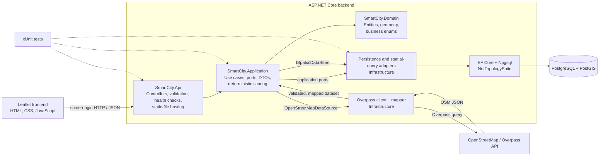
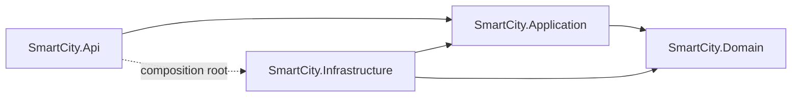

# Architecture

## Overview

SmartCity Location Intelligence uses a clean-architecture-style backend with a
static Leaflet client. The ASP.NET Core project is the composition root: it hosts
the frontend, exposes JSON endpoints, and connects application interfaces to
Infrastructure implementations through dependency injection.

The following diagram shows runtime request and data flow. The arrow from an
application use case to an Infrastructure adapter represents a call through an
interface owned by the Application layer; it is not a compile-time dependency
from Application to Infrastructure.



## Component responsibilities

| Component | Responsibility |
| --- | --- |
| `SmartCity.Api` | HTTP boundary and composition root. Controllers validate transport input, call application abstractions, and return DTOs or Problem Details. `Program.cs` configures dependency injection, options, exception handling, health checks, and same-origin frontend hosting. |
| `SmartCity.Application` | Use cases and contracts. It contains service interfaces, request/response models, OSM import orchestration, coverage and accessibility analysis, incident recommendation, and explainable priority rules. It does not know how PostgreSQL or HTTP clients are implemented. |
| `SmartCity.Domain` | Core persisted entities and business enums, including hospitals, fire stations, roads, incidents, incident types, and priority levels. Spatial entity properties use NetTopologySuite geometry types with SRID 4326. |
| `SmartCity.Infrastructure` | Adapters for external systems. It implements application ports with EF Core/PostGIS persistence, parameterized spatial SQL, dashboard queries, incident storage, the `HttpClientFactory`-managed Overpass client, and OSM response mapping. It also owns database mappings and migrations. |
| `frontend` | Framework-free HTML, CSS, and JavaScript UI using Leaflet. It selects map coordinates, calls relative `/api/...` endpoints, renders spatial layers and analyses, and supports Turkish and English. The files are copied into the API output and publish directories. |
| `tests` | xUnit tests covering controllers, application calculators and orchestration, OSM client/mapping, EF configuration, persistence behavior, and the PostGIS SQL contract. Tests are consumers of production projects and are not part of the runtime dependency graph. |

## Dependency direction

Compile-time dependencies point toward policy and contracts:



- `SmartCity.Domain` has no project-layer dependency.
- `SmartCity.Application` references `SmartCity.Domain` and owns the interfaces
  needed by its use cases.
- `SmartCity.Infrastructure` references Application to implement those interfaces,
  and Domain to persist its entities.
- `SmartCity.Api` references Application for contracts and Infrastructure only to
  register concrete adapters. Controllers receive interfaces rather than construct
  database or Overpass clients.
- The frontend crosses an HTTP/JSON boundary and has no .NET project reference.

The usual request path is:

```text
Frontend
  -> API controller
  -> Application abstraction/service
  -> Infrastructure adapter
  -> EF Core / Npgsql / PostGIS
  -> PostgreSQL
```

Responses travel back through the same boundaries as application DTOs and JSON.
Expected external-source and persistence failures are translated centrally into
Problem Details responses.

## Why spatial work stays in PostgreSQL

Nearest-service analysis is executed by PostGIS rather than loading every hospital
and fire station into application memory. Each parameterized query constructs the
selected WGS 84 point with `ST_SetSRID(ST_MakePoint(longitude, latitude), 4326)`,
casts stored and selected geometries to `geography`, calculates `ST_Distance` in
metres, orders in the database, and returns only the nearest row.

This design:

- avoids transferring and materializing an entire spatial table for one answer;
- keeps coordinate-system and distance semantics consistent at the data boundary;
- lets PostgreSQL filter, rank, and limit close to the stored data;
- keeps GiST-indexed spatial columns available for spatial predicates and future
  query optimization; and
- leaves application services focused on orchestration and explainable business
  rules rather than reimplementing GIS algorithms.

The returned distance is geodesic straight-line distance, not road-network distance
or estimated travel time. The project therefore makes no routing claim.
