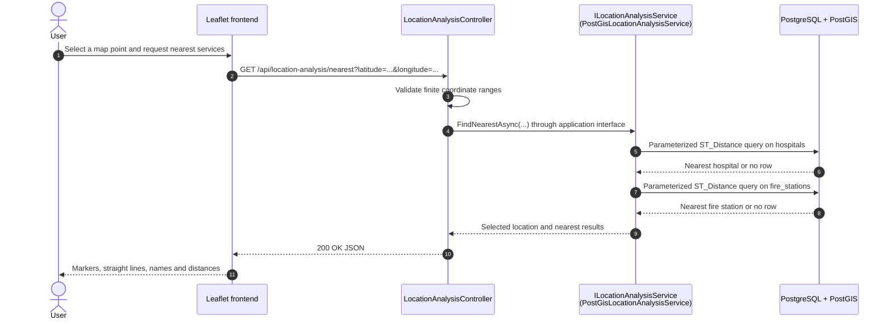

# Request Flows

This document follows the four main end-to-end paths from HTTP input to their data
or decision result. Coordinates use WGS 84 (SRID 4326), with longitude as X and
latitude as Y in NetTopologySuite and PostGIS.

## A. OpenStreetMap import

`POST /api/import/openstreetmap` has no request body. The configured pilot-area
bounding box determines what is imported.

```mermaid
sequenceDiagram
    autonumber
    actor Caller
    participant C as OpenStreetMapImportController
    participant I as ImportOpenStreetMapDataService
    participant OC as OverpassClient + mapper
    participant OSM as Overpass API
    participant DS as OpenStreetMapSpatialDataStore
    participant EF as EF Core / Npgsql
    participant DB as PostgreSQL + PostGIS

    Caller->>C: POST /api/import/openstreetmap
    C->>I: ImportAsync()
    I->>I: Read configured pilot-area bounding box
    I->>OC: FetchAsync(boundingBox)
    OC->>OSM: POST generated Overpass query
    OSM-->>OC: OSM JSON elements
    OC->>OC: Enforce limits; map and validate features
    OC-->>I: Hospitals, fire stations, roads
    I->>DS: AddNewAsync(dataset)
    DS->>EF: Query existing OSM source/external IDs
    EF->>DB: SELECT existing IDs
    DB-->>EF: Existing IDs
    EF-->>DS: Materialized ID sets
    DS->>DS: Keep only unseen entities
    DS->>EF: Add ranges; SaveChangesAsync()
    EF->>DB: INSERT Point/LineString geometries (SRID 4326)
    DB-->>EF: Commit result
    DS-->>I: Added counts
    I-->>C: Found and added counts
    C-->>Caller: 200 OK
```

The mapper creates stable IDs such as `node/123` or `way/456`, removes duplicates
within a response, skips invalid coordinates or unusable road geometry, and creates
NetTopologySuite `Point` and `LineString` values. The store compares
`(Source, ExternalId)` before insert; matching unique database indexes provide a
second integrity boundary. Repeating the same import therefore adds no duplicate
OSM features.

The Overpass client uses configured primary and fallback endpoints. Network errors,
timeouts, and server-side failures trigger one fallback attempt. Invalid responses,
rate limiting, and configured response-size violations fail explicitly. External
source failures become HTTP 502; database failures become HTTP 503.

## B. Nearest emergency service



For each service table, PostGIS calculates
`ST_Distance(stored_geometry::geography, selected_point::geography)`, orders by the
calculated distance, and applies `LIMIT 1`. Casting SRID 4326 geometry to
`geography` produces metre-based geodesic distance. A service result is nullable
when its table has no rows. Invalid coordinates return HTTP 400 before a database
query; persistence failures return HTTP 503.

## C. Incident creation

Priority preview is optional. Creation always recalculates the recommendation and
priority on the server, so a client cannot submit its own score as authoritative.

```mermaid
sequenceDiagram
    autonumber
    actor User
    participant UI as Leaflet frontend
    participant C as IncidentsController
    participant IS as IncidentService
    participant PS as IncidentPriorityService
    participant LA as PostGIS location analysis
    participant AS as AccessibilityAnalysisService
    participant PC as Recommendation + priority calculators
    participant DB as PostgreSQL + PostGIS
    participant D as Dashboard endpoint

    User->>UI: Choose map point, incident type, optional description
    UI->>C: POST /api/incidents
    C->>C: Validate type, coordinates and description length
    C->>IS: CreateAsync(...)
    IS->>PS: AnalyzeAsync(location, incidentType)
    PS->>LA: Find nearest hospital and fire station
    LA->>DB: PostGIS distance queries
    DB-->>LA: Nearest services and metre distances
    LA-->>PS: Nearest-services result
    PS->>AS: Analyze(existing nearest result)
    AS-->>PS: Accessibility score and level
    PS->>PC: Select relevant service and calculate priority
    PC-->>PS: Recommendation, score, level and breakdown
    PS-->>IS: Complete analysis
    IS->>IS: Normalize description; create SRID 4326 point and UTC timestamp
    IS->>DB: INSERT incident through EF Core
    DB-->>IS: Generated incident ID
    IS-->>C: Incident, recommendation and priority
    C-->>UI: 201 Created
    UI->>UI: Render marker and update visible incident count
    UI->>D: GET /api/dashboard/summary
    D->>DB: Aggregate current incident data
    DB-->>D: Counts and latest incidents
    D-->>UI: Refreshed dashboard summary
```

Relevant-service selection is deterministic: Fire uses the nearest fire station;
Medical and Accident use the nearest hospital; Other uses the closest available of
the two. Accessibility is calculated once from the already-fetched nearest result.
The stored incident contains type, normalized description, point, UTC occurrence
time, priority score, and priority level. The response also carries the current
recommended service and the full priority breakdown.

## D. Priority preview

```mermaid
sequenceDiagram
    autonumber
    actor User
    participant UI as Leaflet frontend
    participant C as IncidentPriorityController
    participant PS as IncidentPriorityService
    participant LA as ILocationAnalysisService
    participant DB as PostgreSQL + PostGIS
    participant AS as AccessibilityAnalysisService
    participant RS as IncidentRecommendationSelector
    participant PC as IncidentPriorityCalculator

    User->>UI: Select point and incident type; choose Preview Priority
    UI->>C: GET /api/location-analysis/incident-priority?latitude=...&longitude=...&incidentType=...
    C->>C: Validate coordinates and enum value
    C->>PS: AnalyzeAsync(latitude, longitude, incidentType)
    PS->>LA: FindNearestAsync(...)
    LA->>DB: Hospital and fire-station distance queries
    DB-->>LA: Nearest services
    LA-->>PS: Nearest-services result
    PS->>AS: Analyze(nearest result)
    AS-->>PS: Accessibility level
    PS->>RS: Select relevant service for incident type
    RS-->>PS: Service and distance, or unavailable
    PS->>PC: Calculate(type, distance, accessibility level)
    PC-->>PS: Score, level and three-part breakdown
    PS-->>C: Priority analysis
    C-->>UI: 200 OK preview JSON
    UI-->>User: Score, level, service, accessibility and breakdown
```

The response is an explainable structured result rather than generated prose. It
contains the relevant service type and distance, accessibility level, and the three
score components, allowing the bilingual frontend to present the reasoning without
changing the calculation. Preview performs no insert or update.

## Phase 5A priority rules

The calculation is deterministic:

```text
priority score = clamp(type base score + distance contribution + accessibility penalty, 0, 100)
```

### Incident-type base score

| Incident type | Points |
| --- | ---: |
| Fire | 40 |
| Medical | 35 |
| Accident | 30 |
| Other | 20 |

### Relevant-service distance contribution

| Distance | Points |
| --- | ---: |
| Up to and including 1,000 m | 0 |
| More than 1,000 m, up to and including 2,000 m | 10 |
| More than 2,000 m, up to and including 3,000 m | 20 |
| More than 3,000 m, up to and including 5,000 m | 30 |
| More than 5,000 m | 40 |
| Relevant service unavailable | 50 |

### Accessibility penalty

`AccessibilityAnalysisService` derives one accessibility level from the nearest
hospital and fire-station distances. Priority then maps that level as follows:

| Accessibility | Penalty |
| --- | ---: |
| Excellent | 0 |
| Good | 5 |
| Moderate | 10 |
| Poor | 15 |
| Critical | 20 |

The accessibility level reflects both service types, while the separate distance
contribution uses only the service relevant to the incident. Each available service
contributes 50 points at up to 1 km, 45 at up to 2 km, 35 at up to 3 km, 25 at up
to 5 km, and 10 beyond 5 km; an unavailable service contributes 0. The combined
total is Excellent at 80+, Good at 60+, Moderate at 40+, Poor at 20+, and Critical
below 20.

### Priority level

| Final score | Level |
| --- | --- |
| 0–29 | Low |
| 30–49 | Medium |
| 50–69 | High |
| 70–100 | Critical |

This is an explainable project-level decision-support score. It is **not** an
official emergency dispatch protocol, medical triage system, or real-world
response-time model. Its distance input is geodesic straight-line distance, not a
route, traffic condition, or travel-time estimate.
